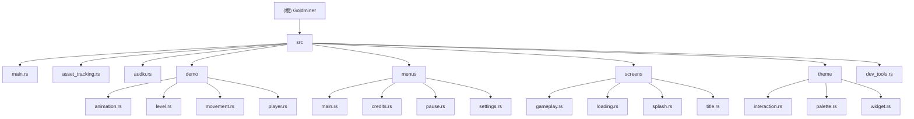

# Goldminer

> **项目愿景**: 一个基于 Bevy 游戏引擎开发的 2D 采矿游戏，具有完整的游戏循环、UI系统和音效支持。

## 变更记录 (Changelog)

**2025-11-18 15:03:39** - 初始化项目文档，完成自适应架构分析

## 架构总览

Goldminer 是一个使用 Rust 和 Bevy 游戏引擎开发的 2D 游戏。项目采用模块化架构，使用 Bevy 的 ECS（实体组件系统）架构和状态机来管理游戏逻辑。

### 核心架构特点
- **引擎**: Bevy 0.17 (Rust 游戏引擎)
- **架构模式**: ECS (Entity Component System)
- **状态管理**: Bevy States 系统管理游戏状态
- **资源管理**: 自定义资源加载系统，支持异步加载
- **平台支持**: 原生平台和 Web 平台 (WASM)

## 模块结构图



## 模块索引

| 模块 | 路径 | 职责描述 | 语言 |
|------|------|----------|------|
| [main](src/main.rs) | 入口文件 | 应用初始化、插件配置、系统集管理 | Rust |
| [asset_tracking](src/asset_tracking.rs) | 资源管理 | 高级资源加载和依赖跟踪 | Rust |
| [audio](src/audio.rs) | 音效系统 | 音乐和音效播放管理 | Rust |
| [demo](src/demo/) | 游戏演示 | 玩家控制、动画、关卡等演示内容 | Rust |
| [menus](src/menus/) | 菜单系统 | 主菜单、设置、暂停、制作人员界面 | Rust |
| [screens](src/screens/) | 屏幕管理 | 游戏状态和屏幕转换逻辑 | Rust |
| [theme](src/theme/) | UI主题 | 颜色方案、交互效果、UI组件 | Rust |
| [dev_tools](src/dev_tools.rs) | 开发工具 | 开发调试和性能监控工具 | Rust |

## 运行与开发

### 开发环境要求
- Rust 1.70+ (edition 2024)
- Bevy 0.17

### 构建和运行
```bash
# 开发模式运行（本地）
cargo run

# Web 开发模式
bevy run web

# 发布构建
cargo build --release
```

### 开发特性
- 动态链接优化编译时间
- 资源热重载
- 内置开发工具和调试功能
- 性能分析支持 (Tracy)

## 测试策略

当前项目**暂无**测试文件。建议添加以下测试类型：
- 单元测试：核心游戏逻辑
- 集成测试：系统间交互
- 玩法测试：游戏循环和状态转换

## 编码规范

### Rust 代码规范
- 使用 `rustfmt` 进行代码格式化
- 遵循 `clippy` 静态分析规则
- 使用 Bevy 特定的代码约定：
  - 系统函数命名遵循 Bevy 约定
  - 组件使用 `derive(Component, Reflect)`
  - 资源使用 `derive(Resource, Asset)`

### Bevy 特定约定
- 使用插件模式组织模块
- 状态驱动架构
- ECS 组件设计原则
- 资源和系统生命周期管理

## AI 使用指引

### 项目结构理解
- 游戏使用 Bevy 的 ECS 架构
- 状态机管理游戏流程
- 模块化插件系统
- 自定义资源加载系统

### 开发建议
1. **新功能开发**: 遵循现有模块的插件模式
2. **状态管理**: 使用 Bevy States 进行屏幕和菜单状态管理
3. **资源处理**: 使用现有的 `LoadResource` trait 进行资源加载
4. **UI 开发**: 使用 theme 模块提供的组件和样式
5. **音频系统**: 使用 audio 模块的 music/sound_effect 辅助函数

### 代码修改原则
- 保持 ECS 架构一致性
- 遵循 Bevy 最佳实践
- 维护现有的状态管理结构
- 使用现有的主题和样式系统